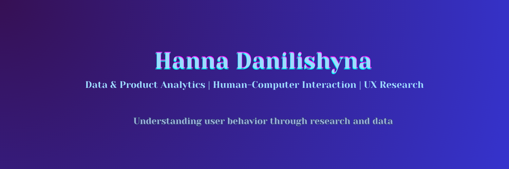

# Hi, I'm Hanna Danilishyna 👋

**Data & Product Analytics | Human-Computer Interaction | UX Research**

I study how people interact with digital systems and how data can help us understand those interactions.

My work sits at the intersection of **Human-Computer Interaction, behavioral research, and data analytics**, where qualitative insights about user experience meet quantitative analysis of user behavior.

I am particularly interested in using **data to understand how people actually use products and how those insights can support better product decisions**.

🌍 Based in Germany  
🔗 GitHub: https://github.com/Hanna-Danilishyna  
🔗 LinkedIn: https://linkedin.com/in/hanna-danilishyna
🔗 Portfolio: https://hanna-danilishyna-portfolio.netlify.app

---

# My Background

My path into analytics started with a deep curiosity about **how people experience technology**.

I hold a **Master’s degree in Human-Computer Interaction from Bauhaus-Universität Weimar**, where I studied how interfaces shape human interaction with complex information systems.

Before that, I completed a **Bachelor’s degree in Engineering Psychology focused on Information Technologies**, which gave me a strong foundation in:

• cognitive psychology  
• human factors  
• system design  
• user behavior in digital environments 
• ergonomics

Through this interdisciplinary background I became interested in a central question:

> How can we understand user behavior not only through research and observation, but also through data?

---

# My Research Approach

I work with **mixed research methods**, combining qualitative and quantitative approaches.

Qualitative research helps uncover **motivations, expectations, and mental models**, while quantitative analysis reveals **patterns in user behavior at scale**.

Over the past years I developed strong expertise in qualitative UX research:

• user interviews  
• usability testing  
• focus groups  
• behavioral observations  
• journey mapping and personas  

These methods help explain **why users behave the way they do**.

At the same time I am expanding my expertise in **quantitative research and behavioral data analysis**, working with:

• SQL  
• Python (pandas, numpy, matplotlib)  
• statistical analysis  
• data visualization  

This allows me to explore **what users actually do in products and systems**.

---

# What I'm Currently Exploring

Currently I am deepening my knowledge in:

• **product analytics**  
• **behavioral data analysis**  
• **data-informed product decisions**  
• **machine learning fundamentals**

I am especially interested in how teams can combine **UX research insights with behavioral data** to build better digital products.

---

# Professional Experience

### UX/UI Design Working Student

In my previous role I conducted **end-to-end user research** for a new product line.

This involved working directly with users through interviews, surveys, and focus groups and analyzing both qualitative and quantitative data.

Research insights were translated into product improvements that resulted in:

• **20% increase in user satisfaction**  
• **85% positive early user feedback**

This experience strengthened my interest in **connecting research insights with data analysis to support product decisions**.

---

# Research

### Emotion Bouquet — Mensch und Computer 2024

A research project exploring how emotions can be represented through **physical interactive systems**.

The project investigates how **movement, color, and pneumatic structures** can represent the dynamic nature of emotional experiences.

📄 DOI: https://doi.org/10.18420/muc2024-mci-demo-371

---

# Featured Projects

### E-commerce Analytics Project
End-to-end data analytics project based on the Olist e-commerce dataset.

Key components:

• relational database design in PostgreSQL  
• SQL exploratory analysis  
• customer and sales analytics  
• data visualization in Python  

Repository:  
https://github.com/Hanna-Danilishyna/ecommerce_analytics

---

### Digital Footprint Analysis

Master’s thesis exploring **personal data exposure on social media** and how users can better understand and control their digital footprints.

The project investigates:

• privacy awareness  
• behavioral patterns in online self-disclosure  
• interface design for data transparency  

---

# Technologies

### Data & Analytics

### Research

User Interviews  
Usability Testing  
Survey Design  
A/B Testing  
Behavioral Analysis  

### Tools

PostgreSQL  
SPSS  
Tableau  
Google Analytics  
Mixpanel  
Hotjar  
Figma  

---

# Connect With Me

💼 LinkedIn  
https://linkedin.com/in/hanna-danilishyna

📧 Email  
hanna.danilishyna@gmail.com
